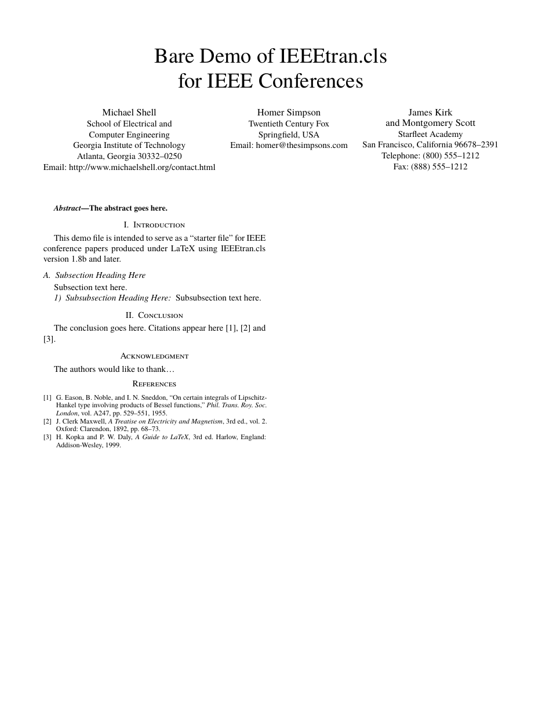
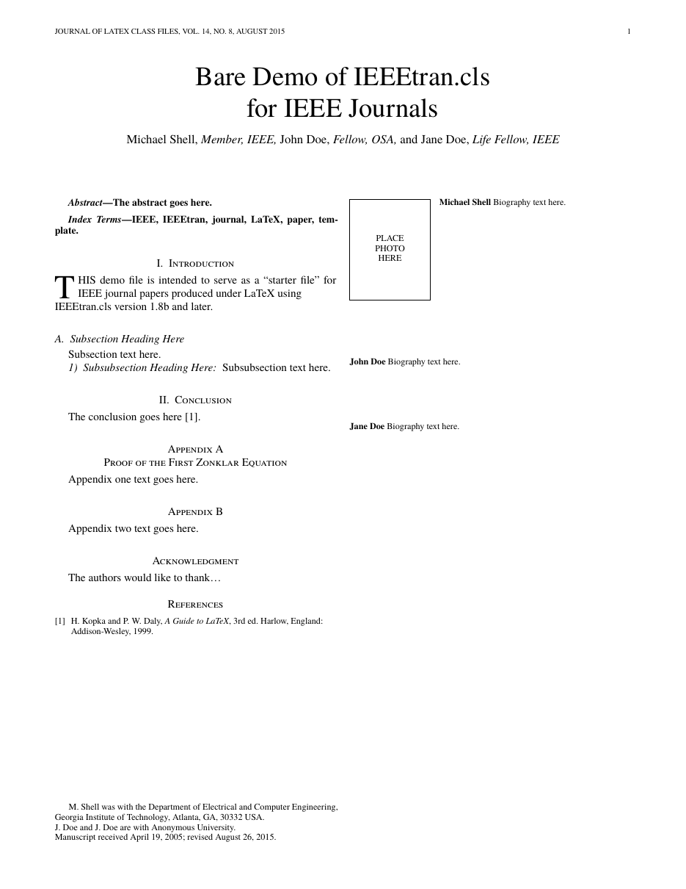

# ieee-templates-typst

[](https://github.com/langestefan/ieee-templates-typst/actions/workflows/tests.yml)
[](https://github.com/langestefan/ieee-templates-typst/actions/workflows/lint.yml)
[](https://typst.app/)
[](LICENSE)

**IEEE conference and journal papers in Typst, ported from `IEEEtran.cls` v1.8b.**

Not a wrapper around LaTeX and not an approximation by eye. Every layout constant is taken from the
IEEEtran class source, and the output is checked baseline-for-baseline against IEEE's own compiled PDFs.

> [!IMPORTANT]
> Pre-release. The conference and journal layouts are complete and verified; the society variants
> (`compsoc`, `comsoc`, `transmag`, `technote`) are not implemented yet. See [Status](#status).

<p align="center">
  
  
</p>

## Quick example

```typst
#import "@preview/ieee-templates:0.1.0": ieee-conference

#show: ieee-conference.with(
  title: [A Paper About Something],
  authors: (
    (
      name: "Ada Lovelace",
      affiliation: (
        "Dept. of Analytical Engines",
        "Somewhere University",
        "London, United Kingdom",
        "ada@example.org",
      ),
    ),
    (
      name: "Alan Turing",
      affiliation: ("Dept. of Computing", "Elsewhere University", "Manchester, UK"),
    ),
  ),
  abstract: [The abstract goes here, set in bold at 9pt as IEEE requires.],
  index-terms: [component, formatting, style],
  bibliography: bibliography("refs.bib"),
)

= Introduction
Body text. Sections number themselves `I.`, `II.` in centred small caps.

== Subsection Heading
Subsections are italic and lettered `A.`, `B.`

=== Subsubsection
Subsubsections run into the paragraph, as IEEE sets them.

= Conclusion
Cite things normally @lovelace1843. References use Typst's built-in IEEE style.
```

## Installation

Via Typst Universe (once published):

```typst
#import "@preview/ieee-templates:0.1.0": ieee-conference, ieee-journal
```

Or locally, by cloning the repo and importing from a path:

```typst
#import "path/to/ieee-templates-typst/src/lib.typ": ieee-conference
```

Compiling a local file needs `--root` so the absolute imports resolve:

```bash
typst compile --root . paper.typ
```

### Fonts

IEEE requires Times. The templates ask for `Times New Roman`, then `TeX Gyre Termes`, then
`Nimbus Roman`, all metric-compatible. At least one is present on most systems; the latter two ship with
most TeX distributions and Linux desktops. Typst warns about the first missing family even when a
fallback is used, so `unknown font family: times new roman` on a machine without it is harmless.

## API

### `ieee-conference`

| Argument | Type | Default | Notes |
|---|---|---|---|
| `paper` | `"us-letter"` \| `"a4"` | `"us-letter"` | Both verified against IEEE renders |
| `title` | content | `[]` | Use `\` for a line break |
| `authors` | array of dicts | `()` | See below |
| `thanks` | content | `none` | Funding note; renders as an unmarked footnote on page 1 |
| `abstract` | content | `none` | Set bold at 9pt, run in after `Abstract—` |
| `index-terms` | content | `none` | Same treatment after `Index Terms—` |
| `bibliography` | content | `none` | Pass `bibliography("refs.bib")` |

Each author is a dict with `name` and `affiliation`. Both accept either content or an array of lines:

```typst
(name: "Ada Lovelace", affiliation: ("Dept. of Analytical Engines", "London, UK"))
(name: [Ada Lovelace#author-mark(1)], affiliation: [Dept. \ London, UK])
```

The array form is usually easier: it avoids escaping, since a bare `@` in Typst markup parses as a
reference and a bare URL autolinks.

Author blocks wrap automatically. Six authors become two rows of three, the same way `\and` and `\hfill`
break in LaTeX.

### `ieee-journal`

Everything above, plus:

| Argument | Type | Notes |
|---|---|---|
| `columns` | `2` \| `1` | `1` matches the `onecolumn` class option |
| `peerreview` | bool | Cover page carrying the authors, then the title repeated overleaf for double-blind review |
| `technote` | bool | Title in the first column rather than spanning, set `\large` bold |
| `header-left` | content | Journal line. Shown on page 1 and on even pages |
| `header-right` | content | Author line, e.g. `Shell et al.: Title`. Shown on odd pages after the first |

With `columns: 1` the abstract and index terms are no longer run in: each gets a centred bold label with
its text indented beneath, which is what IEEEtran does in single-column mode.

`authors` is a single content value here, not an array of blocks, matching how IEEE sets journal author
lines: `Michael Shell, _Member, IEEE,_ John Doe, _Fellow, OSA_`.

### Helpers

| Function | Use |
|---|---|
| `parstart(body)` | `\IEEEPARstart`: the two-line drop cap opening a journal paper |
| `appendices` | `#show: appendices` switches sections to `Appendix A`, `Appendix B` |
| `biography(name:, photo:, body)` | Author biography with a photo box, or a framed placeholder |
| `biography-no-photo(name:, body)` | Same without the photo area |
| `author-mark(n)` | `\IEEEauthorrefmark`: `*`, `†`, `‡`, `§`, `¶`, `‖`, `**`, `††`, `‡‡`, then roman numerals |

A journal paper using all of them:

```typst
#import "@preview/ieee-templates:0.1.0": *

#show: ieee-journal.with(
  title: [A Paper About Something],
  authors: [Ada Lovelace, _Member, IEEE,_ and Alan Turing, _Fellow, IEEE_],
  header-left: [IEEE Transactions on Something, Vol. 1, No. 1, January 2026],
  header-right: [Lovelace #emph[et al.]: A Paper About Something],
  abstract: [The abstract goes here.],
  index-terms: [component, formatting, style],
)

= Introduction
#parstart[This first paragraph opens with a two-line drop cap, and the rest of
the first word is set in capitals, exactly as IEEEtran does it.]

= Conclusion
The conclusion goes here.

#show: appendices
= Proof of the First Zonklar Equation
Appendix text.

#biography(name: [Ada Lovelace])[Biography text here.]
#biography-no-photo(name: [Alan Turing])[Biography text here.]
```

### Figures and tables

Standard Typst figures. The templates supply IEEE's conventions:

```typst
#figure(caption: [Example of a figure caption.], image("fig1.png"))   // Fig. 1. below
#figure(caption: [Table Type Styles], table(columns: 2, [a], [b]))    // TABLE I above
```

Figures number in arabic and caption below; tables number in uppercase roman and caption above, with the
caption text in small caps. In prose a reference reads `Table I` and `Fig. 1`, while the caption itself
reads `TABLE I` — IEEE distinguishes the two, and LaTeX never had to because `\ref` emits only the
number.

Equations number as `(1)` flush right, and `@eq` references render as a bare `(1)`.

`IEEEeqnarray` has no port and needs none: Typst's native math already aligns on `&` and breaks on `\`,
which is what that environment exists to work around in LaTeX. The one thing IEEE uses that Typst lacks is
sub-numbering, so `subequations` supplies it:

```typst
#subequations[
  $ a + b &= c $ <a>
  $ d     &= e $ <b>
]
```

The group takes one equation number and its members are lettered `(2a)`, `(2b)`, with numbering resuming
at `(3)` afterwards. References follow suit.

## Status

| Mode | Verified against |
|---|---|
| `ieee-conference` | `bare_conf.tex` and IEEE's 2024-06-28 wrapper |
| `ieee-journal` | `bare_jrnl.tex`, two columns and one |
| `ieee-transmag` | `bare_jrnl_transmag.tex` |
| `ieee-compsoc` | `bare_jrnl_compsoc.tex` |
| `ieee-compsoc-conference` | `bare_conf_compsoc.tex` |

All on US Letter and A4, plus `technote` and `peerreview` as arguments to
`ieee-journal`. Every asserted landmark matches its reference exactly; what the
port does not do, and why, is in [docs/known-gaps.md](docs/known-gaps.md).

`peerreview` and `technote` are arguments to `ieee-journal`, and are verified the
same way against `bare_jrnl.tex` compiled with each option.

`comsoc` needs no separate mode: per the class changelog, V1.8b's Communications
Society option only swaps in the newtxmath math fonts, leaving it geometrically
identical to a plain journal.

`ieee-conference` and `ieee-journal` take `pt`, which selects the font ladder
and with it the page geometry. Only 10pt is verified: no reference render exists
at any other size, and the title-block spacing is calibrated for 10pt.

Not implemented: automatic last-page column balancing, which Typst cannot do —
`#colbreak()` is the manual remedy.

### The two Computer Society modes

`ieee-compsoc` is a different design rather than a variant of the others:
Palatino body at 9.5pt on 11.54pt leading, 61 lines per column, Helvetica bold
small-caps headings numbered `1`, `1.1`, and a diamond rule closing the title
block. It is the only mode needing fonts beyond Times:
[TeX Gyre Pagella](https://ctan.org/pkg/tex-gyre-pagella) and Nimbus Sans are
the free choices, and `--font-path` works if they are not installed system wide.

`ieee-compsoc-conference` is set in Times and needs no extra fonts. Its sections
are numbered `1.`, `1.1.` with trailing periods, in bold roman.

## Verification

The point of this port is that it is checked, not eyeballed. Notes on the
awkward parts of the port are in [docs/porting-notes.md](docs/porting-notes.md).

```bash
scripts/check.sh
```

Compiles every template and asserts 59 landmark baselines against IEEE's compiled reference PDFs in
`reference/pdf/`. Conference, journal and A4 all match their references exactly on title, authors,
abstract, index terms and first section; the largest remaining discrepancy anywhere is 1pt.

CI runs the same script on every push and pull request, on a runner with the
Nimbus and TeX Gyre fonts installed; a missing font fails the job rather than
silently skipping the checks that need it. Formatting is enforced with
[typstyle](https://github.com/typstyle-rs/typstyle) and the shell scripts with
ShellCheck at its default severity.

Two supporting tools:

- `scripts/baselines.sh <pdf> [page] [max-x]` — prints true text baselines via Ghostscript's `txtwrite`.
  Use this rather than `pdftotext`, which only exposes ink bounding boxes; those shift by up to 2pt
  depending on whether a line happens to contain descenders, which is the same magnitude as the spacing
  being measured.
- `scripts/verify-geometry.sh <pdf> <page> [ref] [page]` — text-block extent, line count, modal advance.

## Repository layout

```
src/
  lib.typ            public API
  conference.typ     conference layout
  journal.typ        journal, plus technote and peer review
  transmag.typ       Transactions on Magnetics
  compsoc.typ        Computer Society journal and conference
  common/            geometry, headings, floats, elements, drop cap, biography
template/            the starter `typst init` copies
tests/               ports of IEEE's reference documents, one per mode
scripts/             check.sh and the measurement tools
docs/                known gaps and porting notes
reference/           IEEEtran v1.8b and IEEE's compiled PDFs, not part of the package
```

`tests/` holds a Typst port of each `bare_*.tex`, which is what `scripts/check.sh`
measures against `reference/pdf/`. They are verification fixtures rather than
things to start a paper from; `template/main.typ` is that.

`reference/` is third-party and excluded from the published package: IEEEtran itself is LPPL, while
IEEE's template wrapper and the compiled PDFs are IEEE copyright. See [LICENSE](LICENSE).

## License

MIT for `src/`, `template/` and `scripts/`. See [LICENSE](LICENSE) for the boundary with `reference/`.
